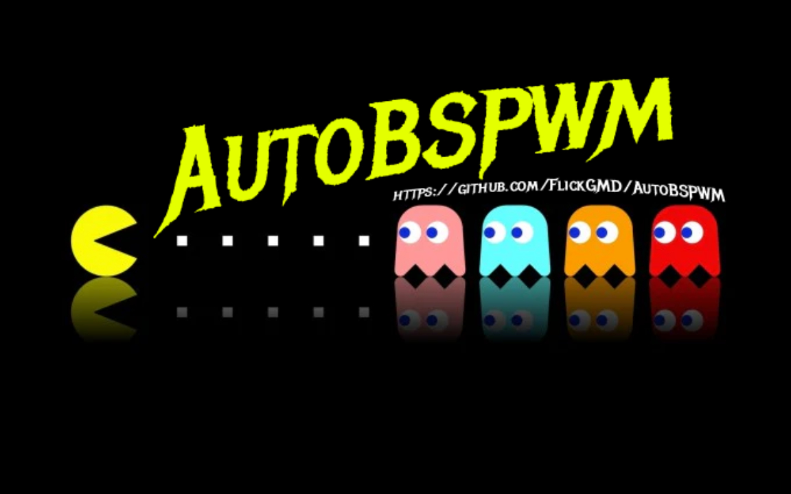
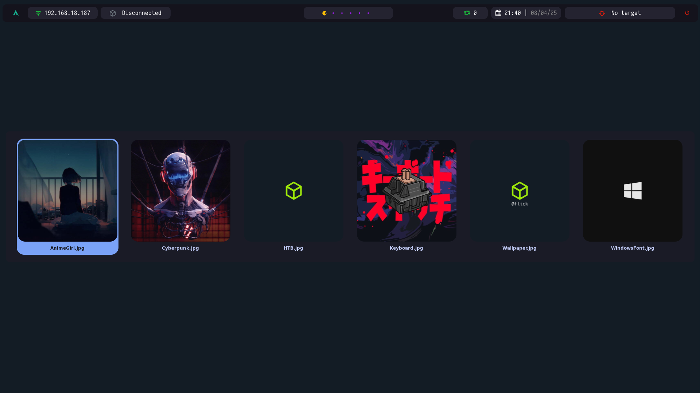
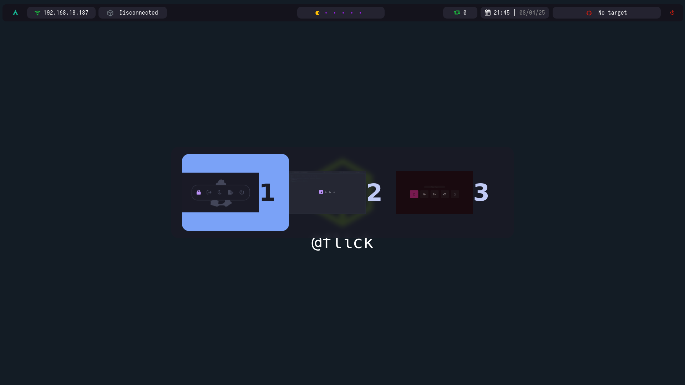
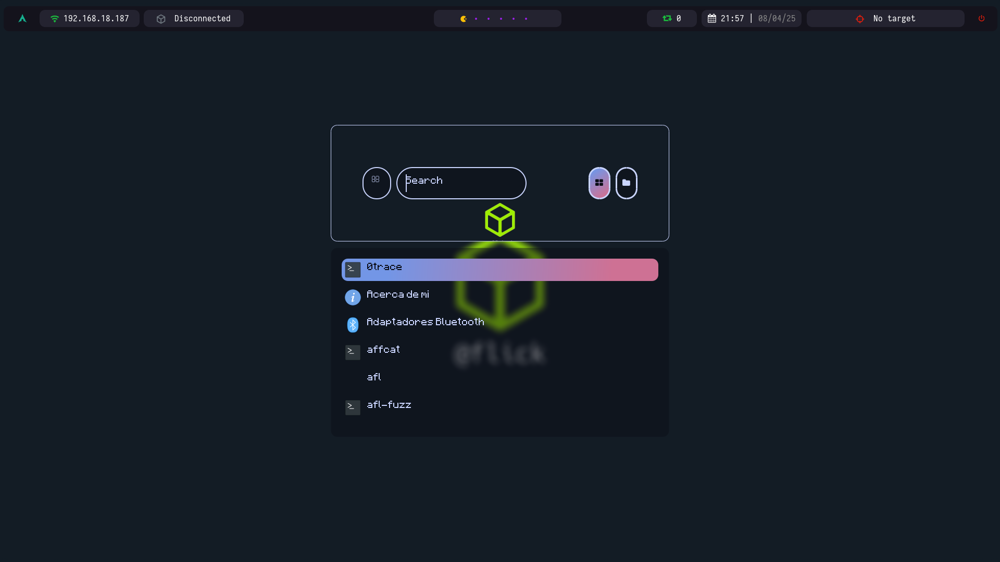
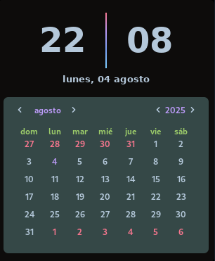
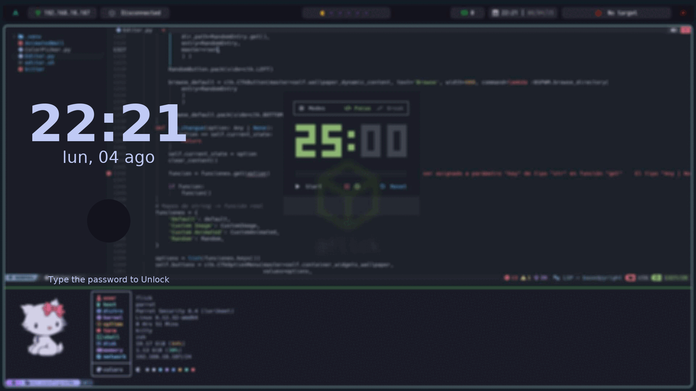
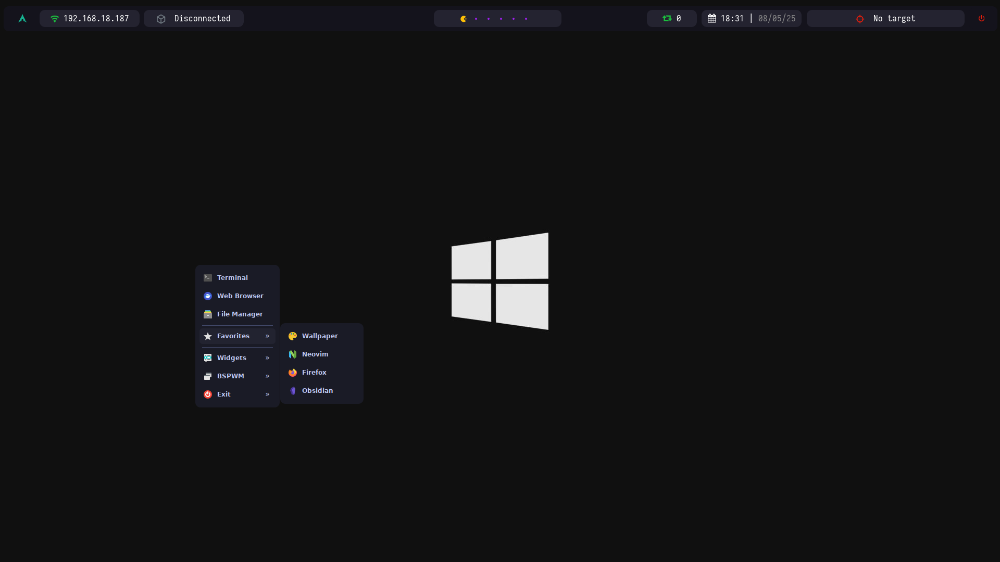
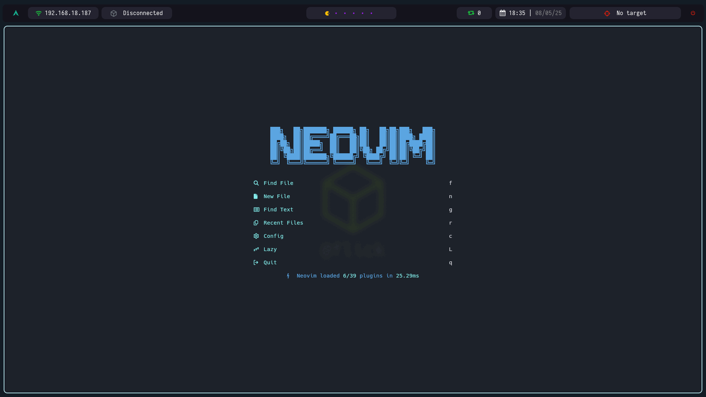

<h1 style="text-align: center;">Entorno de administrador de ventanas BSPWM completo</h1>

<div style="text-align: center;">
  
</div>

<br>


<div align = center>

&ensp;[<kbd> <br> Instalación <br> </kbd>](#-Instalación)&ensp;
&ensp;[<kbd> <br> Atajos <br> </kbd>](#-atajos-de-teclado--)&ensp;
&ensp;[<kbd> <br> Caracteristicas <br> </kbd>](#--bienvenido)&ensp;
<br><br><br></div>

---

<h3> 👋 Bienvenido</h3>

Bienvenido a mi **AutoBSPWM**, me apodo Flick y soy de Perú. 

Estos archivos de configuración fueron hechos para proporcionar un entorno `BSPWM` ligero, eficiente y funcional. Esta diseñado principalmente para Pentesters pero puede usarse para el día a día. Este entorno es una inspiración hacia los dotfiles del señor gh0stzk, más espeficiamente al tema de Emilia. 

---
## 🚀 Características 


**Rendimiento**

BSPWM se destaca principalmente por ser minimalista y tener un rendimiento optimizado. Si bien es cierto que existe actualmente `Wayland` que consigo esta `Hyprland` que es mucho mas popular y tiene consigo muchas mas posibilidades que BSPWM, estos archivos de configuración consumiran mucho menos de `800MB` al iniciar. Como se dijo anteriormente, un entorno con `Hyprland` tiene mucha mas escala a nivel de estetica, pero es que esos entornos comenzarian consumiendo `1GB` o mas al arrancar.

**Fondo de pantalla con nick personalizado**

El instalador, casi al final te pedira que introduzcas tu nick para meterlo al fondo de pantalla. Si no le pasas tu nick usara la variable `$USER` para meterlo en el fondo de pantalla. De todas formas, tu mismo puedes ejecutar el script y cambiarle el nick cuantas veces quieras.

**Multiplataforma**

Siempre he visto en comunidades a gente preguntar acerca de un **AutoBSPWM** para `Kali` o `Parrot`. Ahora eso se acabo, porque este instalador hara que la configuración planteada funcione perfectamente. Tanto en Kali Linux como en Parrot OS. Y claro, puedes ejecutar el instalador desde la ruta que sea porque el mismo script se encargara de moverte a donde este el ejecutable.

Asimismo, me he topado con uno de los grandes problemas a la hora de realizar este proyecto, que es el tema de los repositorios de `Backports` en Parrot OS. Estos repositorios pueden hacer que tu sistema Parrot sea muy inestable debido. Esto se debe a que `Debian` en sus repositorios trae binarios/dependencias antiguas pero muy bien probadas y seguras. Por ejemplo imagina que estas instalando `nmap` y esta requiere `libpcap v2` pero `wireshark` requiere especificamente `libpcap v1`, ahí esta el problema, incompatibilidad. Estos es solo un ejemplo pero es algo que puede pasarle a cualquiera. Anteriormente para instalar `eww`, el instalador usaba `Docker` por detras para poder mostrar los widgets en bspwm, lo cual es innecesario para un simple widget y ya. Ahora el instalador quita los repositorios de backports, actualiza tu sistema y cuando llega la hora de instalar `eww` el instalador se encarga de downgradear los paquetes que vea necesario para la instalación.

**Rice Editor**

Esta aplicación esta diseñada para simplificar drasticamente la personalización del entorno. Permite configurar la terminal `Kitty` en tiempo real sin reiniciar esta misma. Asimismo, me he dado la tarea de crear una libreria en `Python` llamada `CTkFileDialog` la cual esta hecha para poder cambiar tu fondo de pantalla sin necesidad de usar el dialogo de archivos que tkinter trae. Y claro, la libreria tiene 2 estilos, uno siendo el `Mini` y otro el `Original` pero eso no va al caso. Para mas información, visitar el [repositorio](https://github.com/FlickGMD/CTkFileDialog).

**Menu contextual**

Puedes hacer el clásico click derecho sobre la ventana y veras el clásico menu contextual para poder explorarlo por tu cuenta.

**Bloqueador de pantalla**

Este bloqueador de pantalla no es mio, es del señor gh0stzk. Pero para explicar en que consiste, tomara una captura de pantalla, la difuminara y la mostrara como pantalla de bloqueo hasta que escribas la contraseña.

**Aplicaciones de Rofi**

Aplicaciones de Rofi para optimizar tiempos:

- Selector de fondos de pantalla (Propietario: gh0stzk)
- Menu de apagado
- Selector de Menu de apagado
- Selector de aplicaciones

**Configuración de Tmux**

Esta configuración de Tmux no es mas que `Oh-My-Tmux` la cual sirve bastante para simplificar tu flujo de trabajo, dandote una mejor experiencia.

**Configuración de Neovim**

Configuración de Neovim usando NvChad, algo "compleja" pero potente:

- [stevearc/conform.nvim](https://github.com/stevearc/conform.nvim) — Formateador moderno
- [neovim/nvim-lspconfig](https://github.com/neovim/nvim-lspconfig) — Configuración LSP para Neovim
- [hrsh7th/nvim-cmp](https://github.com/hrsh7th/nvim-cmp) — Autocompletado principal
- [hrsh7th/cmp-nvim-lsp](https://github.com/hrsh7th/cmp-nvim-lsp) — Fuente LSP para `nvim-cmp`
- [hrsh7th/cmp-buffer](https://github.com/hrsh7th/cmp-buffer) — Fuente buffer para `nvim-cmp`
- [hrsh7th/cmp-path](https://github.com/hrsh7th/cmp-path) — Fuente de rutas para `nvim-cmp`
- [hrsh7th/cmp-cmdline](https://github.com/hrsh7th/cmp-cmdline) — Fuente de autocompletado para la línea de comandos
- [L3MON4D3/LuaSnip](https://github.com/L3MON4D3/LuaSnip) — Snippets engine moderno

### 🎨 UI / Interfaz

- [folke/snacks.nvim](https://github.com/folke/snacks.nvim) — UI mejorada (pickers, dashboard, indent guides)
- [rcarriga/nvim-notify](https://github.com/rcarriga/nvim-notify) — Notificaciones emergentes en Neovim
- [karb94/neoscroll.nvim](https://github.com/karb94/neoscroll.nvim) — Scroll suave para Neovim

### ⚙️ Plugins de la comunidad `nvzone`

- [nvzone/volt](https://github.com/nvzone/volt) — Base para otros plugins de `nvzone`
- [nvzone/menu](https://github.com/nvzone/menu) — Menú personalizado
- [nvzone/minty](https://github.com/nvzone/minty) — Comandos `Shades` y `Huefy` para temas
- [nvzone/floaterm](https://github.com/nvzone/floaterm) — Terminal flotante
- [nvzone/showkeys](https://github.com/nvzone/showkeys) — Muestra las teclas presionadas en pantalla
- [nvzone/typr](https://github.com/nvzone/typr) — Plugin de escritura para mejorar velocidad/precisión
- [nvzone/timerly](https://github.com/nvzone/timerly) — Temporizador y gestión de tiempo

### 📝 Markdown

- [MeanderingProgrammer/render-markdown.nvim](https://github.com/MeanderingProgrammer/render-markdown.nvim) — Renderizado visual de Markdown
- [nvim-treesitter/nvim-treesitter](https://github.com/nvim-treesitter/nvim-treesitter) — (Dependencia para el plugin de Markdown)
- [nvim-tree/nvim-web-devicons](https://github.com/nvim-tree/nvim-web-devicons) — Iconos para archivos y UI

**Configuración de ZSH**

Esta configuración de zsh trata de ser minimalista y optima en cuanto a rendimiento respecta, no `Oh-My-Zsh` ni esas cosas. 

Alguna de las caracteristicas que traera la `zsh`: 

- `pyenv`: Función para instalar librerias de Python de forma automatizada en un entorno virtual.
- Se excluyen los directorios `__pycache__` al ejecutar programas escritos en Python.
- Resaltado de sintaxis 
- Autocompletado con `Fzf`
---

<h2> 🎨 Lanzadores </h2>

| Selector de Wallpapers |
|--------|
|  | 

| Selector de menu de apagado |
|--------|
|  | 

| Selector de aplicaciones |
|--------|
|  | 

## Rice Editor

https://github.com/user-attachments/assets/d1bdaa69-cabf-4d6b-96d9-fffe9f8e3928


## Eww widget

| Calendario |
|--------|
|  |

## Bloqueador de pantalla 

|  |
| :--------------------------------------------------------------------------------------------: |
|                                           Bloqueador de pantalla                                           |


## JGmenu

|  |
| :--------------------------------------------------------------------------------------------: |
|                                           JGmenu                                           |

## Neovim Setup
|  |
| :--------------------------------------------------------------------------------------------: |
|                                           Neovim Setup                                           |

> [!NOTE]
> Si deseas ver todos los comandos posibles de Neovim (NvChad) puedes ejecutar en el cmd de nvim lo siguiente
> ```lua
> NvCheatsheet
> ```
> También se han añadido 3 atajos al Neovim. 
> - `Click derecho` = Abrir menu contextual personalizado.
> - `Ctrl + P` = Abrir el picker.
> - `Ctrl + Alt + T` = Abrir la terminal flotante.

---

<h2> Atajos de teclado ⌨ </h2>

| Combinación               | Acción                                                             |
|--------------------------|--------------------------------------------------------------------|
| Windows + Enter          | Abrir terminal                                            |
| Windows + Shift + E      | Abrir Neovim                                          |
| Windows + Shift + S      | Selector de tema de menu de apagado (Polybar)                                         |
| Windows + Shift + O      | Abrir Obsidian                                                     |
| Windows + Shift + X      | Bloquear pantalla                                                  |
| Windows + D              | Abrir selector de aplicaciones                                             |
| Windows + W              | Selector de wallpapers                                      |
| Windows + Esc            | Recargar `sxhkd`                                                   |
| Windows + Shift + F      | Abrir Firefox                                                      |
| Windows + Shift + Q      | Salir de BSPWM                                                     |
| Windows + Shift + R      | Reiniciar BSPWM                                                    |
| Windows + Q              | Cerrar ventana                                                     |
| Windows + Shift + Q      | Forzar cierre de ventana                                           |
| Windows + M              | Alternar modo monocromo (layout)                                   |
| Windows + Y              | Traer ventana marcada                                              |
| Windows + G              | Enviar ventana al más grande                                       |
| Windows + T              | Establecer modo Tiled                                              |
| Windows + Shift + T      | Establecer modo Pseudo-Tiled                                       |
| Windows + S              | Establecer modo Floating                                           |
| Windows + F              | Establecer modo Pantalla completa                                  |
| Windows + Ctrl + M       | Marcar ventana                                                     |
| Windows + Ctrl + X       | Bloquear ventana                                                   |
| Windows + Ctrl + Y       | Hacer ventana "sticky"                                             |
| Windows + Ctrl + Z       | Hacer ventana privada                                              |
| Windows + ← ↓ ↑ →        | Mover foco entre ventanas                                          |
| Windows + Shift + ← ↓ ↑ →| Mover ventana                                                      |
| Windows + Alt + ← ↓ ↑ →  | Redimensionar ventana                        |
| Windows + Ctrl + Alt + ← ↓ ↑ → | Preselección para mover ventana                          |
| Windows + Ctrl + Alt + Espacio | Cancelar preselección                                   |
| Windows + Ctrl + Shift + Espacio | Cancelar todas las preselecciones del escritorio actual |
| Windows + P              | Foco al padre                                                      |
| Windows + B              | Foco al hermano                                                    |
| Windows + ,              | Foco al primero                                                    |
| Windows + .              | Foco al segundo                                                    |
| Windows + C              | Foco siguiente ventana                                             |
| Windows + Shift + C      | Foco ventana anterior                                              |
| Windows + [              | Ir al escritorio anterior                                          |
| Windows + ]              | Ir al escritorio siguiente                                         |
| Windows + `              | Ir al último nodo activo                                           |
| Windows + Tab            | Ir al último escritorio activo                                     |
| Windows + O              | Foco a ventana más antigua                                         |
| Windows + I              | Foco a ventana más reciente                                        |
| Windows + (1–9, 0)       | Cambiar de escritorio                                              |
| Windows + Shift + (1–9, 0)| Mover ventana al escritorio                                       |
| Windows + Ctrl + (1–9)   | Crear ventana fantasma en escritorio                               |
| Windows + A              | Tomar captura y copiarla al portapapeles              |
| Click derecho (mouse)    | Mostrar menú contextual con jgmenu                                 |


---

## 👀 Instalación

> [!NOTE]
> Este script esta pensado para funcionar en Kali Linux y Parrot OS, posiblemente funcione en un debian limpio. Pero realmente no funcionaria en otra distribución, si deseas bajarte los dotfiles y usas otra distro tal vez deberias hacerlo de forma manual.

> [!CAUTION]
> Mis archivos de configuración estan pensados para monitores 1920x1080 usando 96 de DPI. Si usas una resolución mas baja o DPI mas bajo, deberas de ajustar los archivos de configuración de forma manual.

```bash
# Clonamos el repositorio
git clone https://github.com/FlickGMD/AutoBSPWM.git

# Navegamos al directorio
cd AutoBSPWM

# Ejecutamos el instalador 
./Install.sh
```

## 😵‍💫 Problemas y errores comunes

Si por desgracia llegas a tener algún error, puedes visitar el gitbook de pylon. Ahí encontraras solución a varios de los problemas que pueden surgir en bspwm.

[](https://pylonet.gitbook.io/hack4u)
